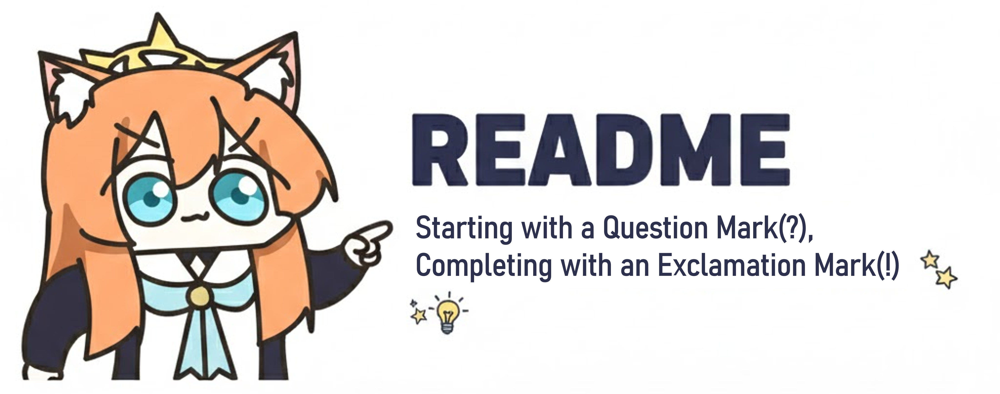

  
  
   
**leejunho, a Planner Who Turns Imagination into Reality**

> **"Starting with a Question Mark(?), Completing with an Exclamation Mark(!)."**
> Hello! I am **leejunho**, a planner who enjoys turning wild imaginations into concrete plans and finally bringing them to life.

### 👋 Who am I?

I am a **student who finds joy in learning** and a **planner who relentlessly seeks answers**.
I approach the world with the question **"Why?"**, deliberate on **"How"** to solve problems, and strive to deliver results that make people say, **"This is it!"**

* **Curious Learner:** I am not afraid to dig into unknown fields. New knowledge is the best ingredient for my planning.
* **Logical Dreamer:** I have the ability to materialize vague ideas into logical documents and actionable processes.
* **Action Maker:** I don't stop at planning; I ensure that ideas are realized into tangible results.

---

### 🧩 My Keywords

Here are the keywords that best describe me.

* **🔭 Observation:** I never miss the chance to spot inconveniences in daily life or emerging trends.
* **📝 Implementation:** I transform abstract ideas into structured proposals and roadmaps.
* **🤝 Communication:** I actively communicate and coordinate to ensure the outcome belongs to "us," not just "me."

---

### 📖 User Manual (How to work with me)

1. **"Why?" comes from interest, not aggression.**
* I ask many questions to grasp the essence of the problem. Once convinced, I dive into execution faster than anyone else.

2. **I believe there is no planning without documentation.**
* I meticulously record brainstorming sessions and document everything to share with the team, ensuring nothing is lost.

3. **Feedback is always welcome.**
* I am not afraid of revising my plans if it leads to a better outcome; I embrace change joyfully.
